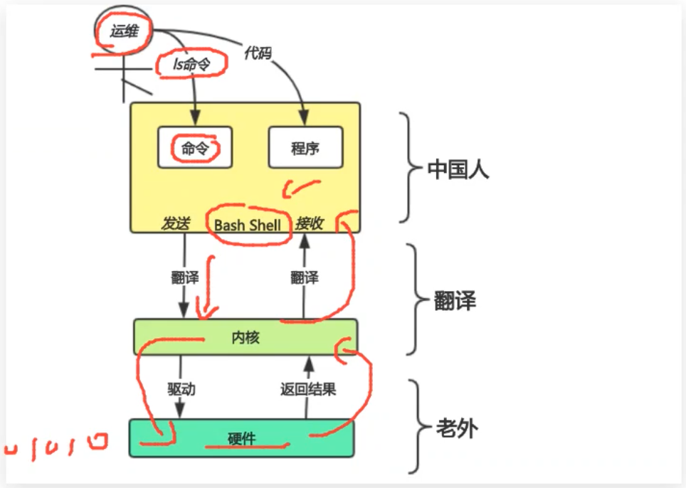

# hi-linux

## base

## file

## shell

`Bash Shell` 是一个命令解释器，主要负责用户程序与内核进行交互操作的一种接口，将用户输入的命令翻译给内核，由内核驱动硬件，最终将处理后的结果输出至 `Bash Shell` 屏幕终端。

- `Bash Shell` 能干什么？主要使用它实现对 `Linux` 系统的大部分管理:
  - 文件
  - 权限
  - 用户
  - 磁盘
  - 网络
  - 软件 等

- 一个命令输入 --> 效率低 --> 适合少量的工作
- Shell Script --> 效率高 --> 适合重复性的工作

- [命令]   [选项]    [参数]
- “打针”   轻|重   {屁股|手臂}

> 原来 docker 里的命令也是这么回事，只不过分先宿主再容器再命令最后参数！

- `history` 查看执行命令的历史
  - `-w` 保存命令历史到历史文件
  - `-c` 清空命令历史记录，不会清空文件
  - `-d` 删除命令历史的前第N条
- `!!` 上一条命令
- `!` 搜索最近关键字开头的命令
  - `ls`
  - `ifconfig`
  - `pwd`
  - `!ifc` -> `ifconfig`
- `> ~/.bash_history` 清空某文件

## rewrite & pipe

## find & compress

## Ubuntu

## crontab

## storage

## backup

## grep-sed-awk-regex
